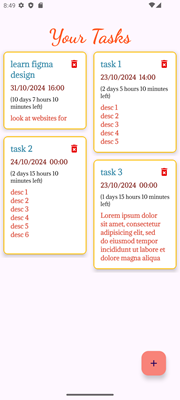
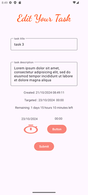
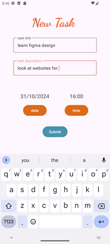
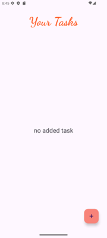
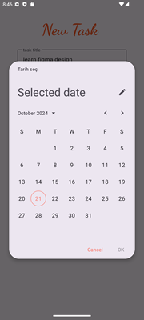
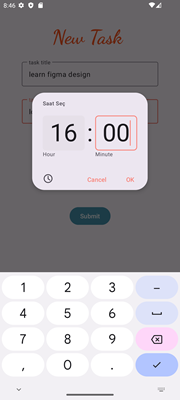

# ToDo App

This **ToDo App** is a powerful and efficient task management tool designed for Android, built using **Jetpack Compose**, **Kotlin**, and modern Android development practices such as **Dagger-Hilt** for Dependency Injection, **Room Database** for local storage, and **Material Design Components** for an intuitive user experience. The app features CRUD operations (Create, Read, Update, Delete) for tasks, utilizes **ViewModel** and **LiveData** for reactive UI updates, and offers a beautiful **StaggeredGridLayout** for displaying tasks.

## Features
- **Task Management (CRUD):**
    - Users can add, edit, delete, and view tasks.
    - Tasks are stored locally using Room Database.

- **Deadline Management:**
    - Set deadlines using **MaterialDatePicker** and **MaterialTimePicker**.
    - Remaining time for tasks is calculated and displayed.

- **Modern UI/UX:**
    - **RecyclerView** with **StaggeredGridLayout** for task display.
    - Material Design principles for a clean and user-friendly interface.

- **Dependency Injection with Dagger-Hilt:**
    - **Dagger-Hilt** is used for seamless Dependency Injection throughout the app, improving testability and modularity.

## Architecture
The app follows the **MVVM (Model-View-ViewModel)** architecture pattern to ensure separation of concerns and facilitate easier testing and maintenance.

### Layers:
1. **UI Layer (View)**:
    - Jetpack Compose-based UI components.
    - Fragments and Navigation Components for routing between screens.

2. **ViewModel Layer**:
    - **TaskViewModel** interacts with the repository and handles UI-related data, making use of Kotlin coroutines and `viewModelScope` to manage background tasks efficiently.

3. **Repository Layer**:
    - **TaskRepository** handles data operations by interacting with the local data source (Room) via a **DataSource** class, abstracting data access logic from the ViewModel.

4. **Room Database Layer**:
    - Local storage of tasks using Room with an **Entity-DAO** pattern.

## Tech Stack

- **Kotlin**: Programming language.
- **Jetpack Compose**: For building the UI in a declarative manner.
- **Room**: For local database management.
- **Dagger-Hilt**: For Dependency Injection.
- **Coroutines**: For asynchronous operations.
- **LiveData**: For observing and updating the UI.
- **RecyclerView**: For displaying tasks.
- **MaterialDatePicker** and **MaterialTimePicker**: For selecting task deadlines.
- **Navigation Component**: For handling in-app navigation.

## Project Setup

### Prerequisites
- Android Studio 4.0+
- Kotlin 1.5+
- Android SDK 21+

### Steps to Run
1. Clone this repository:
   ```bash
   git clone https://github.com/muameh/NotesApp.git









